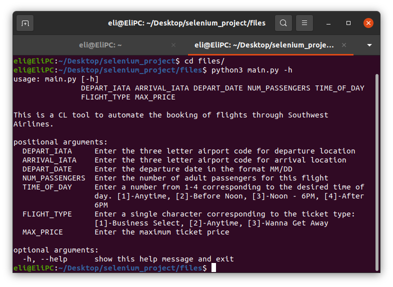

# Southwest Airlines Automated Flight Booker

Booking flights can be a tedious ordeal that involves the entry of large
amounts of data. My automation tool aims to provide a simple, easy to use
command line interface in order to expedite this process.

By entering basic flight information through the command line, this tool will automatically pull up
the cheapest flight meeting your constraints, and you only have to enter personal and payment data in order to book it. If no flight meeting the maximum desired price is found, the page is left open for the user to select a different option.

The image below details the inputs required for operation.

In the future, this could be automated to a much further extent. I plan on taking text files containing address information as well as payment info through paypal (handling raw card data seems problematic).
